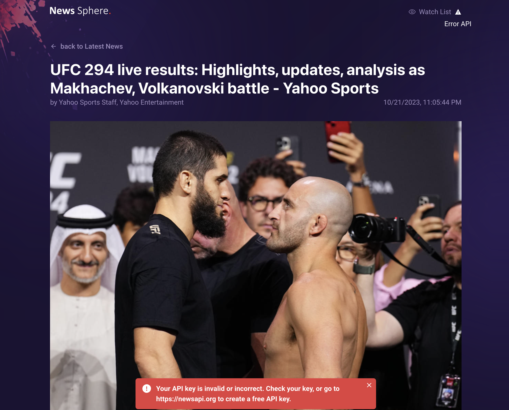
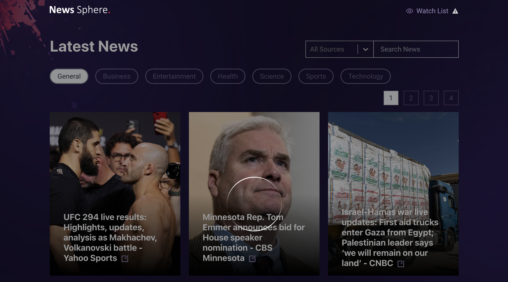

<div id="top"></div>
<div align="center">

[![LinkedIn][linkedin-shield]][linkedin-url]

</div>

<!-- PROJECT LOGO -->
<br />
<div align="center">
  <a href="">
    
  </a>
  <h1 align="center">News Sphere.</h1>
  <p align="center">
    <a href="https://next-news-l9mrlv28b-sudeshnt.vercel.app"><strong>View Demo »</strong></a>
    <br />
  </p>
</div>
<!-- TABLE OF CONTENTS -->
<details>
  <summary>Table of Contents</summary>
  <br />
  <ol>
    <li>
      <a href="#about-the-project">About The Project</a>
      <ul>
        <li><a href="#in-this-application-you-have-the-ability-to">Features</a></li>
        <li><a href="#built-with">Built With</a></li>
      </ul>
    </li>
    <li>
      <a href="#getting-started">Getting Started</a>
      <ul>
        <li><a href="#prerequisites">Prerequisites</a></li>
        <li><a href="#installation">Installation</a></li>
      </ul>
    </li>
    <li><a href="#contact">Contact</a></li>
  </ol>
</details>

<!-- ABOUT THE PROJECT -->

## About The Project

### Screenshots

<div align="center">
  
  
  
  
  
  
  
  
  
  
  
</div>
<br />

### In this Application you have the ability to

- Fetch top news headlines from multiple news providers.
- You have the ability to filter the headlines with the category and source.
- You can search headlines by keyword with the debounced search input.
- Headlines list is paginated to show 12 news headlines per page.
- There's a watch list to get a list of news headlines you read in the past.
- On each news headline card, there's a `Read More` button to go to the detail page of that headline.
- News details page will be server side rendered and it'll show the full content of the selected news headline.

<p align="right">(<a href="#top">back to top</a>)</p>

### Built With

<!-- - I have used [Vercel](https://vercel.com/) to host this application to provide a quick preview to the observers. -->

- [React.js](https://reactjs.org)
- [Next.js](https://nextjs.org/docs)
- [Typescript](https://www.typescriptlang.org)
- [Chakra UI](https://chakra-ui.com)
- [Tailwind CSS](https://tailwindcss.com)
- [React Hook Form](https://www.react-hook-form.com)
- [Zod](https://zod.dev)
- [Lodash](https://lodash.com)
- [Zustand](https://www.mongodb.com) for State Management
- [localforage](https://github.com/localForage/localForage)

<p align="right">(<a href="#top">back to top</a>)</p>

<!-- GETTING STARTED -->

## Getting Started

This is a [Next.js](https://nextjs.org/) project bootstrapped with [`create-next-app`](https://github.com/vercel/next.js/tree/canary/packages/create-next-app). with the typescript template.

### Prerequisites

Make sure you have node installed in order to run this application locally.

- upgrade npm to the latest version

```sh
npm install npm@latest -g
```

### Installation

1. Clone the repo

```sh
git clone https://github.com/sudeshnt/next-news-app
```

2. Install node modules using one of the following commands

```sh
npm install
yarn
```

3. In the project directory, you can run either:

```js
npm run dev
yarn dev
```

4. Runs the app in the development mode.

Open [http://localhost:3000](http://localhost:3000) to view it in your browser

5. Launch the test runner in the interactive watch mode.

```js
npm run test
yarn test
```

6. Builds the app for production to the build folder.

```js
npm run build
yarn build
```

<p align="right">(<a href="#top">back to top</a>)</p>

<!-- CONTACT -->

## Contact

Sudesh Nimesha - sudeshnt93@gmail.com

<p align="right">(<a href="#top">back to top</a>)</p>

<!-- MARKDOWN LINKS & IMAGES -->
<!-- https://www.markdownguide.org/basic-syntax/#reference-style-links -->

[linkedin-shield]: https://img.shields.io/badge/-LinkedIn-black.svg?style=for-the-badge&logo=linkedin&colorB=555
[linkedin-url]: https://www.linkedin.com/in/sudeshnt
